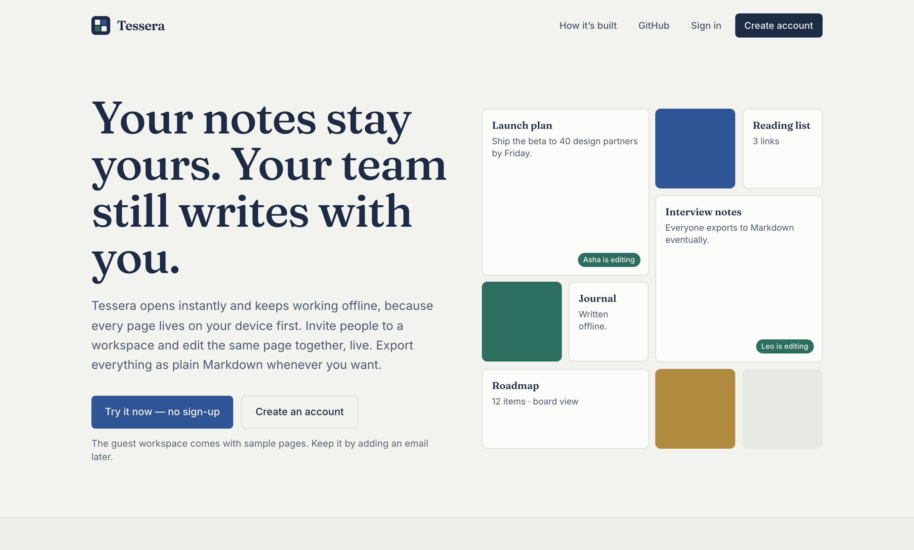
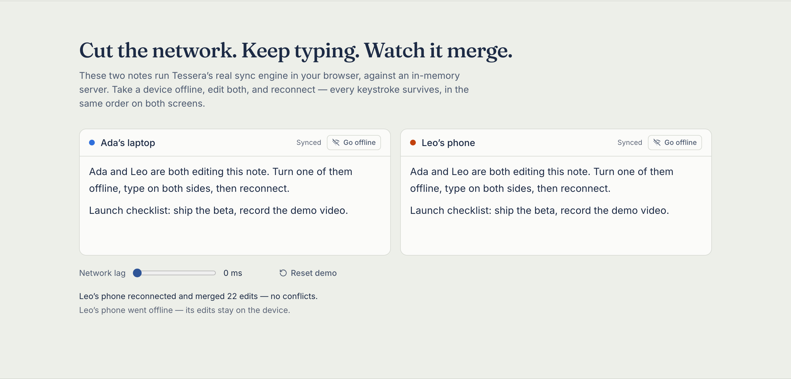
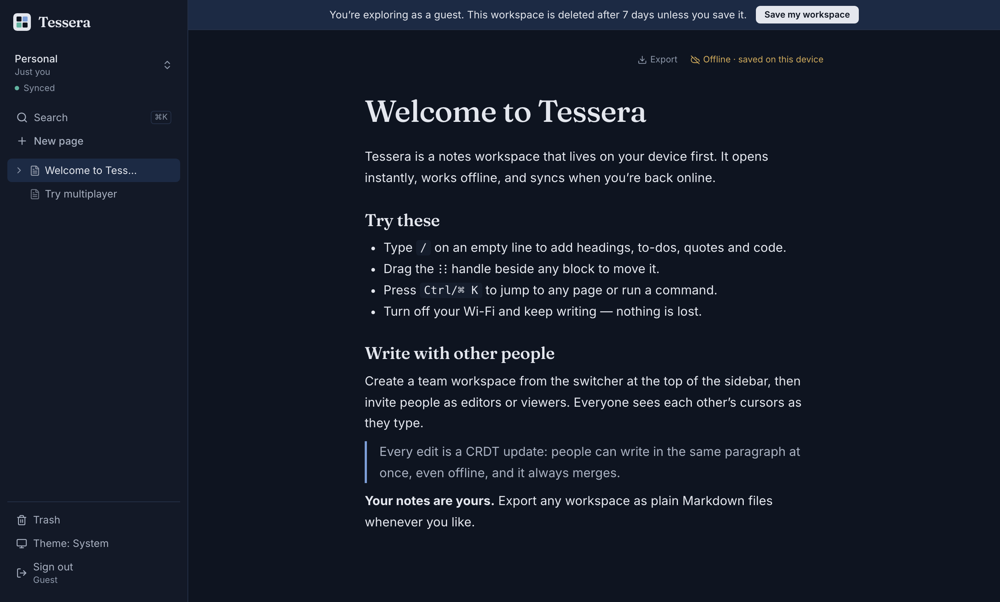
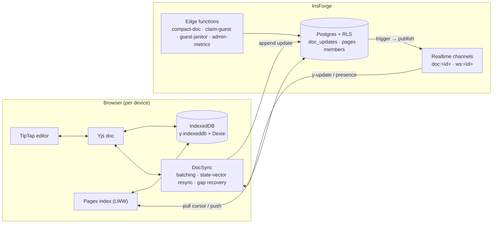

# Tessera

[](https://github.com/codewithsupra/tessera/actions/workflows/ci.yml)

A local-first, multiplayer notes workspace: Obsidian's speed and data ownership, with Notion's live collaboration.

**[Try it now, no sign-up](https://tessera-notes.vercel.app)**: one click gives you a guest workspace with sample pages, which you can keep later by adding an email.
Also: **[How it's built](https://tessera-notes.vercel.app/engineering)**.



## What it does

- **Opens instantly, works offline.** Every page is a Yjs CRDT stored on your device (IndexedDB), so reading and writing never wait for the network.
- **Live multiplayer.** People can edit the same paragraph at the same time and see each other's named cursors. Offline edits from any device merge on reconnect, with no conflict dialogs.
- **Team workspaces.** Invite people by email or invite link, as owner, editor or viewer. Roles are enforced by Postgres row-level security, not just the UI.
- **Your notes are yours.** Export one page or a whole workspace as plain Markdown with frontmatter, in Obsidian-style folders, zipped.
- **Try before signing up.** Start with a one-click guest workspace, then turn it into a real account in place with "Save my workspace".
- **Polish:**
  - command palette (⌘K), keyboard shortcuts (`?`), slash menu and drag handles
  - light and dark themes, installable PWA
  - accessible: WCAG AA, checked by axe

| Live CRDT demo on the landing page | Editor (dark) |
| --- | --- |
|  |  |

## Architecture



- **Sync:**
  - Each edit is appended to `doc_updates`, and a Postgres trigger broadcasts it on the page's realtime channel.
  - On reconnect, a client loads what it missed. It then pushes only the state-vector diff the server lacks, and only if that diff would change the server's state.
- **Compaction:** an edge function folds update logs into snapshots. A version guard stops two compactions running at once from losing data.
- **Security:**
  - Every table has row-level security, using a recursion-free access mirror. The same rules decide who can join a realtime channel.
  - Security headers include a strict CSP.
- **Telemetry:** first-party and privacy-friendly, with no third-party scripts. An owner-only `/admin/metrics` dashboard shows sign-ups, activation, guest conversion and client errors.

The full write-up, including the bugs the tests caught, is at **[/engineering](https://tessera-notes.vercel.app/engineering)**.

## Testing

| Layer | What | Count |
| --- | --- | --- |
| Unit (Vitest) | Sync engine over an in-memory transport (offline, latency, ordering), Markdown serializer, page tree, telemetry | 172 |
| Live backend (`npm run verify:*`) | Run against the real InsForge project: row-level security, invites and roles, guest claims and the janitor, compaction, telemetry, admin metrics | 126 |
| End-to-end (Playwright) | Guest to saved account, two people editing live and a viewer downgrade, offline edits merging after reconnect, export zip contents, command palette, axe scans of every screen | 12 |

CI runs typecheck, lint, unit tests and the build on every push. Playwright and the live suites also run once the backend secrets are configured.

## Stack

- **Frontend:** React 19, TypeScript (strict), Vite, TanStack Router, Tailwind CSS v4, zustand
- **Editor and data:** TipTap v3, Yjs, Dexie
- **Backend:** InsForge (auth, Postgres with row-level security, realtime, edge functions, schedules)
- **Hosting:** Vercel
- **Testing:** Playwright, Vitest

## Develop

```bash
npm install
npm run dev          # http://localhost:5173
npm test             # unit tests
npm run typecheck && npm run lint
```

`.env.local` needs `VITE_INSFORGE_URL` and `VITE_INSFORGE_ANON_KEY`.

The end-to-end and live suites also need:
- `.env.e2e.local` with `E2E_EMAIL`, `E2E_PASSWORD`, `E2E_STRANGER_EMAIL`, `E2E_STRANGER_PASSWORD` and `JANITOR_SECRET`
- the project's admin key: `INSFORGE_API_KEY`, or a linked `.insforge/project.json`

```bash
npm run test:e2e
npm run verify:access   # also: verify:teams, verify:guests, verify:compaction, verify:telemetry, verify:metrics
```

To regenerate the README screenshots, run `npx playwright test -c playwright.shots.config.ts`.
